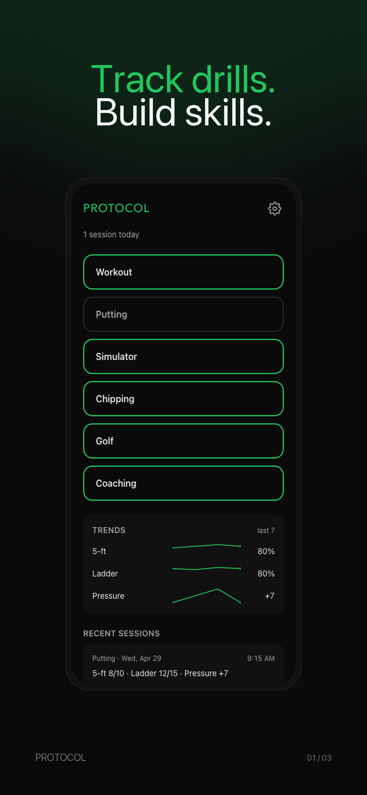
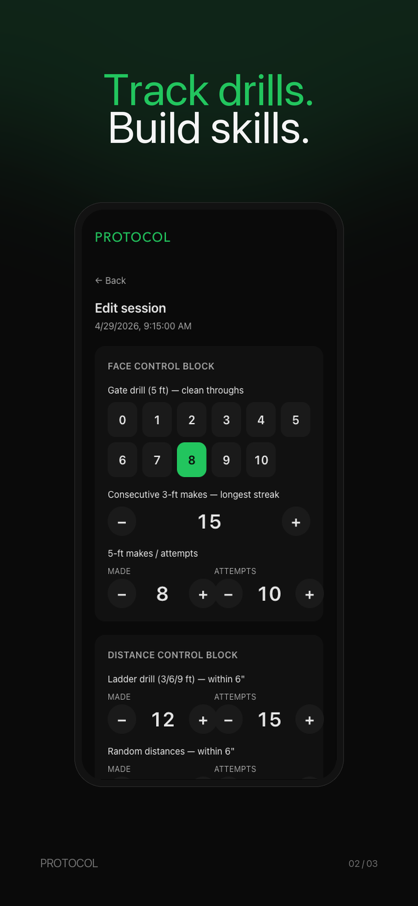
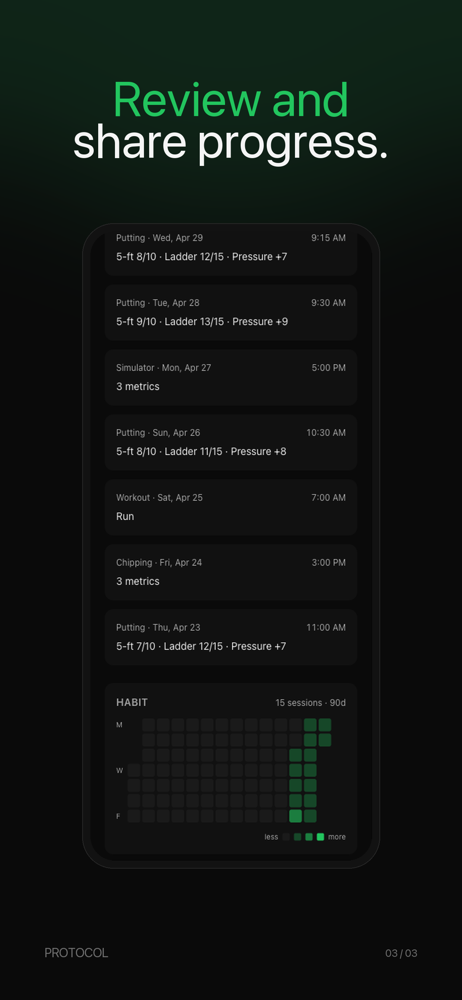

# PROTOCOL

A golf practice tracker.

_Track drills, build skills._

<p align="center">
  
  
  
</p>

## Install on your iPhone

1. **On your iPhone, open Safari.** It must be Safari — Chrome and other browsers can't install web apps to the home screen.
2. Go to: [protocol.golf]([www.protocol.golf](https://protocol.golf/))
3. Tap the **Share** button (the square with an arrow pointing up — usually at the bottom of the screen).
4. Scroll down and tap **Add to Home Screen**.
5. Tap **Add** in the top-right corner.

A PROTOCOL icon will appear on your home screen. Tap it to launch the app full-screen. Everything is stored on your phone — no account, no internet required after the first install.

---

## For developers

Personal mobile-first PWA for capturing practice data across six disciplines (Putting, Chipping, Simulator, Workout, Golf, Coaching). Single user, fully local, no backend, no auth, no telemetry.

**Status:** v0.11 — six disciplines wired, JSON backup/restore landed, v1 ship gate met.

**Spec:** [BRIEF.md](./BRIEF.md) is the canonical source of truth — read it before making architectural changes. [CLAUDE.md](./CLAUDE.md) holds the hard rules for AI-assisted edits.

### Stack

- React + Vite + TypeScript
- Tailwind CSS (custom components, no shadcn)
- Dexie.js over IndexedDB
- vite-plugin-pwa (Workbox)
- Vercel for hosting

### Develop

```bash
npm install
npm run dev        # dev server on :5173
npm run build      # tsc -b && vite build — run before pushing; Vercel fails on tsc errors
npm run preview    # serve dist/ on :4173
```

### Hard rules

- All data local. No backend, no analytics, no telemetry.
- Offline-first. No external CDN at runtime.
- 30-second rule: full Phase 1 putting entry must complete in ≤30s of input time.
- Multi-discipline data model is permanent.

### Backup & restore

Settings → Backup & restore exports a `practice-tracker.v1` JSON file containing every session. Import accepts the same format with skip-duplicates default and an opt-in "Replace all" mode (gated behind a confirm dialog). CSV and markdown exports remain coaching-share formats and are intentionally lossy.
